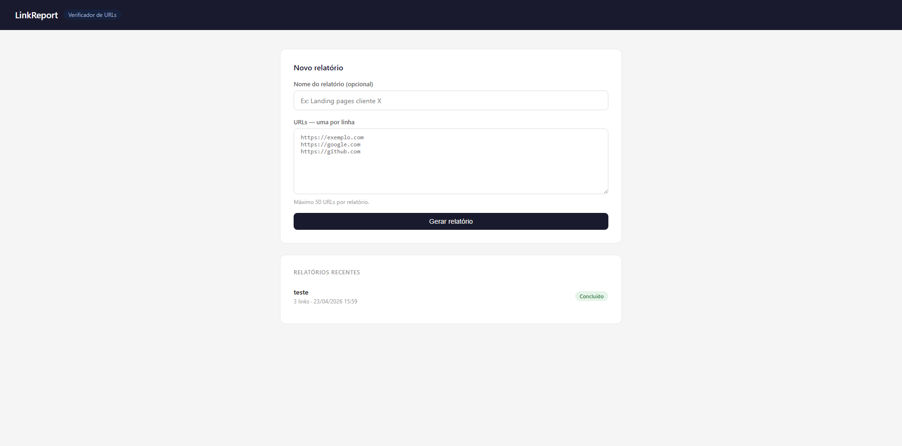
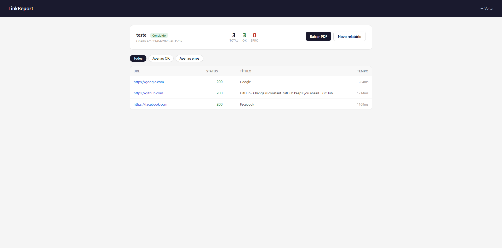
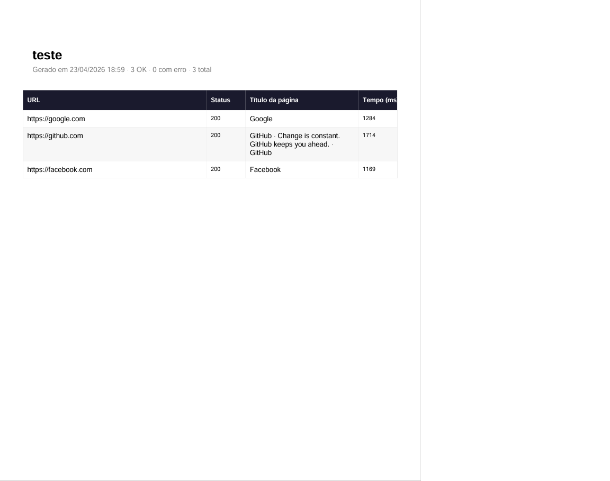

# LinkReport

A Django web application that verifies URLs in bulk, extracts page metadata, and generates formatted PDF reports — built for agencies, SEO professionals, and developers who need to audit links at scale.

---

## Features

- Submit up to 50 URLs at once and get results in seconds
- Extracts HTTP status code, page title, meta description, and response time for each URL
- Filter results by status (all / OK / errors)
- Download a formatted PDF report with one click
- Clean, responsive interface with real-time progress feedback

## Screenshots

### Dashboard


### Report detail


### PDF export


---

## Tech Stack

| Layer | Technology |
|---|---|
| Back-end | Python 3.14, Django 6 |
| REST API | Django REST Framework |
| Scraping | Requests, BeautifulSoup4 |
| PDF generation | ReportLab |
| Database | SQLite (dev) / PostgreSQL (prod) |
| Static files | WhiteNoise |
| Deployment | Railway |

---

## Getting Started

### Prerequisites

- Python 3.10+
- pip

### Installation

```bash
# 1. Clone the repository
git clone https://github.com/your-username/linkreport.git
cd linkreport

# 2. Create and activate a virtual environment
python -m venv venv

# Windows
venv\Scripts\activate

# macOS/Linux
source venv/bin/activate

# 3. Install dependencies
pip install -r requirements.txt

# 4. Apply migrations
python manage.py migrate

# 5. Run the development server
python manage.py runserver
```

Open `http://127.0.0.1:8000` in your browser.

---

## Usage

1. Paste one URL per line into the form
2. Optionally give the report a name
3. Click **Generate report** and wait for the results
4. Filter results by status or download the PDF

---

## Project Structure

```
linkreport/
├── core/
│   ├── models.py       # Report and LinkResult models
│   ├── views.py        # Request handling, scraping, PDF generation
│   ├── admin.py        # Django admin config
│   └── migrations/
├── linkreport/
│   ├── settings.py
│   └── urls.py
├── templates/
│   ├── index.html      # Home page with URL form
│   └── report.html     # Report detail with results table
├── requirements.txt
└── manage.py
```

---

## Environment Variables

Create a `.env` file in the root directory for production:

```env
SECRET_KEY=your-secret-key-here
DEBUG=False
ALLOWED_HOSTS=your-domain.com
SCRAPER_TIMEOUT=10
```

---

## Roadmap

- [ ] Async processing with Celery + Redis
- [ ] User authentication and report history per account
- [ ] Screenshot capture for each URL
- [ ] Scheduled reports (run automatically every X days)
- [ ] CSV export in addition to PDF

---

## Author

**Josy M.** — Full Stack Developer (Django + React)

[Upwork Profile](https://www.upwork.com/freelancers/~01886317f5e305d8cf) · [GitHub](https://github.com/JosyMarcos)
